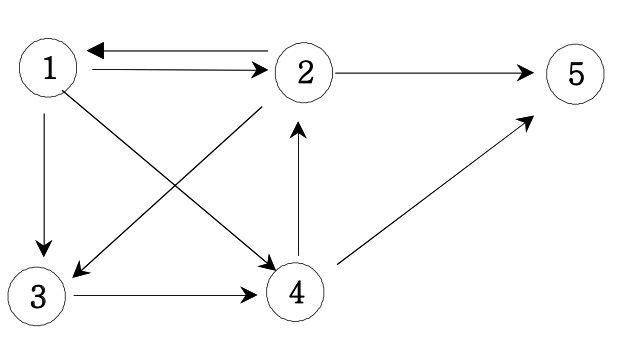

# 경로 탐색(인접행렬)

방향그래프가 주어지면 1번 정점에서 N번 정점으로 가는 모든 경로의 가지 수를 출력하는 프로그램을 작성하세요.

아래 그래프에서 1번 정점에서 5번 정점으로 가는 가지 수는



총 6 가지입니다.

### ▣ 입력설명

첫째 줄에는 정점의 수 N(1<=N<=20)와 간선의 수 M가 주어진다. 그 다음부터 M줄에 걸쳐 연결정보가 주어진다.

### ▣ 출력설명

총 가지수를 출력한다.

### ▣ 입력예제 1

5 9  
1 2  
1 3  
1 4  
2 1  
2 3  
2 5  
3 4  
4 2  
4 5

### ▣ 출력예제 1

6

```javascript
//내코드
function solution(n, arr) {
  const graph = Array.from(Array(n), () => Array(n).fill(0));
  const check = Array.from({ length: n }, () => 0);
  let result = 0;

  arr.forEach(([a, b]) => {
    graph[a - 1][b - 1] = 1;
  });

  DFS(0, check);

  function DFS(node, check) {
    if (node === n - 1) result++;
    else {
      for (let i = 0; i < n; i++) {
        if (graph[node][i] === 1 && check[i] !== 1) {
          check[node] = 1;
          DFS(i, check.slice());
        }
      }
    }
  }
  return result;
}

//강의코드
function solution2(n, arr) {
  let answer = 0;
  let graph = Array.from(Array(n + 1), () => Array(n + 1).fill(0));
  let ch = Array.from({ length: n + 1 }, () => 0);
  path = [];
  for (let [a, b] of arr) {
    graph[a][b] = 1;
  }
  function DFS(v) {
    if (v === n) {
      answer++;
      console.log(path);
    } else {
      for (let i = 1; i <= n; i++) {
        if (graph[v][i] === 1 && ch[i] === 0) {
          ch[i] = 1;
          path.push(i);
          DFS(i);
          ch[i] = 0;
          path.pop();
        }
      }
    }
  }

  path.push(1);
  ch[1] = 1;
  DFS(1);
  return answer;
}

let arr = [
  [1, 2],
  [1, 3],
  [1, 4],
  [2, 1],
  [2, 3],
  [2, 5],
  [3, 4],
  [4, 2],
  [4, 5],
];

console.log(solution(5, arr)); //6
console.log(solution2(5, arr));
// [ 1, 2, 3, 4, 5 ]
// [ 1, 2, 5 ]
// [ 1, 3, 4, 2, 5 ]
// [ 1, 3, 4, 5 ]
// [ 1, 4, 2, 5 ]
// [ 1, 4, 5 ]
// 6
```

쉬운듯하면서 꽤 머리아팠던 문제다. 아무래도 배열의 인덱스가 0부터 시작한다는게 가장 헷갈리게 만드는 포인트같음..
