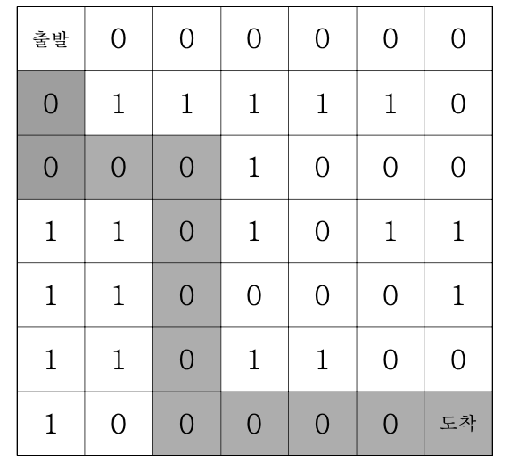

# 미로탐색(DFS)

7\*7 격자판 미로를 탈출하는 경로의 가지수를 출력하는 프로그램을 작성하세요. 출발점은 격 자의 (1, 1) 좌표이고, 탈출 도착점은 (7, 7)좌표이다. 격자판의 1은 벽이고, 0은 통로이다. 격 자판의 움직임은 상하좌우로만 움직인다. 미로가 다음과 같다면



위의 지도에서 출발점에서 도착점까지 갈 수 있는 방법의 수는 8가지이다.

### ▣ 입력설명

7\*7 격자판의 정보가 주어집니다.

### ▣ 출력설명

첫 번째 줄에 경로의 가지수를 출력한다.

### ▣ 입력예제 1

```
0 0 0 0 0 0 0
0 1 1 1 1 1 0
0 0 0 1 0 0 0
1 1 0 1 0 1 1
1 1 0 0 0 0 1
1 1 0 1 1 0 0
1 0 0 0 0 0 0
```

### ▣ 출력예제 1

8

```javascript
//내코드
function solution(board) {
  let result = 0;

  DFS(0, 0);

  function DFS(x, y) {
    if (x === 6 && y === 6) {
      result++;
    } else {
      //상
      if (x - 1 >= 0 && board[x - 1][y] !== 1) {
        board[x][y] = 1;
        DFS(x - 1, y);
        board[x][y] = 0;
      }
      //하
      if (6 >= x + 1 && board[x + 1][y] !== 1) {
        board[x][y] = 1;
        DFS(x + 1, y);
        board[x][y] = 0;
      }
      //좌
      if (y - 1 >= 0 && board[x][y - 1] !== 1) {
        board[x][y] = 1;
        DFS(x, y - 1);
        board[x][y] = 0;
      }
      //우
      if (6 >= y + 1 && board[x][y + 1] !== 1) {
        board[x][y] = 1;
        DFS(x, y + 1);
        board[x][y] = 0;
      }
    }
  }
  return result;
}

//강의코드
function solution2(board) {
  let answer = 0;
  let dx = [-1, 0, 1, 0];
  let dy = [0, 1, 0, -1];
  function DFS(x, y) {
    if (x === 6 && y === 6) answer++;
    else {
      for (let k = 0; k < 4; k++) {
        let nx = x + dx[k];
        let ny = y + dy[k];
        if (nx >= 0 && nx <= 6 && ny >= 0 && ny <= 6 && board[nx][ny] === 0) {
          board[nx][ny] = 1;
          DFS(nx, ny);
          board[nx][ny] = 0;
        }
      }
    }
  }
  board[0][0] = 1;
  DFS(0, 0);
  return answer;
}

let arr = [
  [0, 0, 0, 0, 0, 0, 0],
  [0, 1, 1, 1, 1, 1, 0],
  [0, 0, 0, 1, 0, 0, 0],
  [1, 1, 0, 1, 0, 1, 1],
  [1, 1, 0, 0, 0, 0, 1],
  [1, 1, 0, 1, 1, 0, 0],
  [1, 0, 0, 0, 0, 0, 0],
];

console.log(solution(arr));
console.log(solution2(arr));
```

상하좌우 움직임을 반복문으로 어떻게 표현해야되야될까 고민하다가 마땅한 방법이 떠오르지않아서 그냥 4개 다 코드로 작성했다. DRY를 무시하는 반복되는 코드였지만 그래도 알아보기엔 쉽지않나..싶다 ㅋㅋ.. 풀면서 뭔가 게임만드는거같아서 재밌었던 문제.
