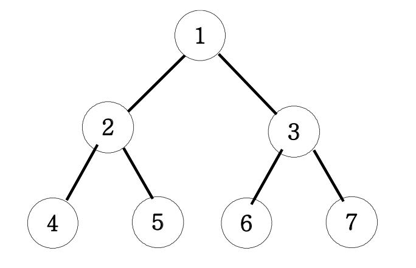

# 이진트리 넓이우선탐색(BFS)

아래 그림과 같은 이진트리를 넓이우선탐색해 보세요.



넓이 우선 탐색 : 1 2 3 4 5 6 7

```javascript
function solution() {
  let result = '';
  const bfs = [];
  bfs.push(1);
  while (bfs.length) {
    const v = bfs.shift();
    result += v + ' ';
    if (v * 2 + 1 <= 7) {
      bfs.push(v * 2);
      bfs.push(v * 2 + 1);
    }
  }
  return result;
}
function solution2() {
  let answer = '';
  let queue = [];
  queue.push(1);
  while (queue.length) {
    console.log(queue);
    let v = queue.shift();
    answer += v + ' ';
    for (let nv of [v * 2, v * 2 + 1]) {
      if (nv > 7) continue;
      queue.push(nv);
    }
  }
  return answer;
}

console.log(solution()); //1 2 3 4 5 6 7
console.log(solution2());
```

간단한 BFS문제
