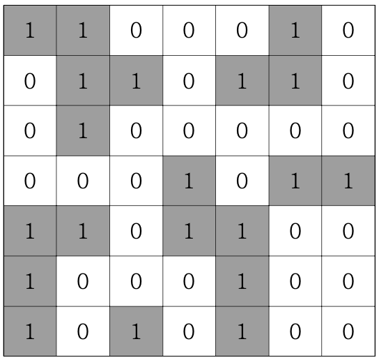

# 섬나라 아일랜드 (DFS)

N\*N의 섬나라 아일랜드의 지도가 격자판의 정보로 주어집니다. 각 섬은 1로 표시되어 상하좌 우와 대각선으로 연결되어 있으며, 0은 바다입니다. 섬나라 아일랜드에 몇 개의 섬이 있는지 구하는 프로그램을 작성하세요.



만약 위와 같다면

### ▣ 입력설명

첫 번째 줄에 자연수 N(3<=N<=20)이 주어집니다. 두 번째 줄부터 격자판 정보가 주어진다.

### ▣ 출력설명

첫 번째 줄에 섬의 개수를 출력한다.

### ▣ 입력예제 1

```
7
1 1 0 0 0 1 0
0 1 1 0 1 1 0
0 1 0 0 0 0 0
0 0 0 1 0 1 1
1 1 0 1 1 0 0
1 0 0 0 1 0 0
1 0 1 0 1 0 0
```

### ▣ 출력예제 1

5

```javascript
//내코드
function solution(b) {
  const s = b.length;
  const dx = [-1, -1, 0, 1, 1, 1, 0, -1];
  const dy = [0, 1, 1, 1, 0, -1, -1, -1];
  let result = 0;

  for (let x = 0; x < s; x++) {
    for (let y = 0; y < s; y++) {
      if (b[x][y] == 1) {
        DFS(x, y);
        result++;
      }
    }
  }

  function DFS(x, y) {
    b[x][y] = 0;

    for (let i = 0; i < 8; i++) {
      let mx = x + dx[i];
      let my = y + dy[i];
      if (mx >= 0 && mx < s && my >= 0 && my < s && b[mx][my] === 1) {
        DFS(mx, my);
      }
    }
  }

  return result;
}

//강의코드
function solution2(board) {
  let answer = 0;
  let n = board.length;
  let dx = [-1, -1, 0, 1, 1, 1, 0, -1];
  let dy = [0, 1, 1, 1, 0, -1, -1, -1];
  function DFS(x, y) {
    board[x][y] = 0;
    for (let k = 0; k < 8; k++) {
      let nx = x + dx[k];
      let ny = y + dy[k];
      if (nx >= 0 && nx < n && ny >= 0 && ny < n && board[nx][ny] === 1) {
        DFS(nx, ny);
      }
    }
  }
  for (let i = 0; i < n; i++) {
    for (let j = 0; j < n; j++) {
      if (board[i][j] === 1) {
        board[i][j] = 0;
        answer++;
        DFS(i, j);
      }
    }
  }
  return answer;
}

let arr = [
  [1, 1, 0, 0, 0, 1, 0],
  [0, 1, 1, 0, 1, 1, 0],
  [0, 1, 0, 0, 0, 0, 0],
  [0, 0, 0, 1, 0, 1, 1],
  [1, 1, 0, 1, 1, 0, 0],
  [1, 0, 0, 0, 1, 0, 0],
  [1, 0, 1, 0, 1, 0, 0],
];

console.log(solution(arr));
// console.log(solution2(arr));
```

해결방법이 떠오르지않아 강의초반부분을 조금보고 힌트를 얻어서 풀었다. 예전에 비슷한문제를 엄청난 중복코드로 풀었었는데 이번에는 dx,dy배열을 선언해서 간략하게 코드를 짤수있었다.
