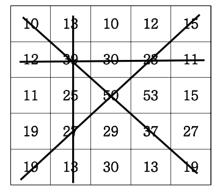

# 격자판 최대합

5\*5 격자판에 아래와 같이 숫자가 적혀있습니다.



N\*N의 격자판이 주어지면 각 행의 합, 각 열의 합, 두 대각선의 합 중 가 장 큰 합을 출력합니다.

### ▣ 입력설명

첫 줄에 자연수 N이 주어진다.(1<=N<=50)

두 번째 줄부터 N줄에 걸쳐 각 줄에 N개의 자연수가 주어진다. 각 자연수는 100을 넘지 않는다.

### ▣ 출력설명

최대합을 출력합니다.

### ▣ 입력예제 1

5

10 13 10 12 15

12 39 30 23 11

11 25 50 53 15

19 27 29 37 27

19 13 30 13 19

### ▣ 출력예제 1

155

```javascript
//내가 풀어본것
function solution(arr) {
  let answer = 0;
  let n = arr.length; //격자판 길이

  let sum1 = 0;
  let sum2 = 0;
  for (let i = 0; i < n; i++) {
    sum1 = 0;
    sum2 = 0;
    for (let j = 0; j < n; j++) {
      sum1 += arr[i][j];
      sum2 += arr[j][i];
    }
    if (sum1 > answer) answer = sum1;
    if (sum2 > answer) answer = sum2;
  }

  let sum3 = 0;
  let sum4 = 0;
  for (let i = 0; i < n; i++) {
    sum3 += arr[i][n - 1 - i];
    sum4 += arr[i][i];
  }
  if (sum3 > answer) answer = sum3;
  if (sum4 > answer) answer = sum4;

  return answer;
}

let arr = [
  [10, 13, 10, 12, 15],
  [12, 39, 30, 23, 11],
  [11, 25, 50, 53, 15],
  [19, 27, 29, 37, 27],
  [19, 13, 30, 13, 19],
];
console.log(solution(arr));
```

처음에는 어떻게 해야할지 감이안잡혀서,

arr\[0\]\[0\]

arr\[0\]\[1\]

arr\[0\]\[2\]

arr\[0\]\[3\]

arr\[0\]\[4\]

이런식으로 하나씩 써보면서 2중 for문 규칙을 찾으려고 했다.

규칙을 다 찾고나서 for문 돌리고 answer와 매번 비교하며 최대값을 넣는방식으로 구현했다.

```javascript
//강의 풀의
function solution(arr) {
  let answer = Number.MIN_SAFE_INTEGER;
  let n = arr.length;
  let sum1 = (sum2 = 0);
  for (let i = 0; i < n; i++) {
    sum1 = sum2 = 0;
    for (let j = 0; j < n; j++) {
      sum1 += arr[i][j];
      sum2 += arr[j][i];
    }
    answer = Math.max(answer, sum1, sum2);
  }
  sum1 = sum2 = 0;
  for (let i = 0; i < n; i++) {
    sum1 += arr[i][i];
    sum2 += arr[i][n - i - 1];
  }
  answer = Math.max(answer, sum1, sum2);
  return answer;
}

let arr = [
  [10, 13, 10, 12, 15],
  [12, 39, 30, 23, 11],
  [11, 25, 50, 53, 15],
  [19, 27, 29, 37, 27],
  [19, 13, 30, 13, 19],
];
console.log(solution(arr));
```

강의에서는 Math.max로 최대값을 구했다.
