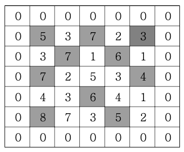

# 봉우리

지도 정보가 N\*N 격자판에 주어집니다. 각 격자에는 그 지역의 높이가 쓰여있습니다. 각 격자 판의 숫자 중 자신의 상하좌우 숫자보다 큰 숫자는 봉우리 지역입니다. 봉우리 지역이 몇 개 있는 지 알아내는 프로그램을 작성하세요.  
격자의 가장자리는 0으로 초기화 되었다고 가정한다.  
만약 N=5 이고, 격자판의 숫자가 다음과 같다면 봉우리의 개수는 10개입니다.



### ▣ 입력설명

첫 줄에 자연수 N이 주어진다.(1<=N<=50)  
두 번째 줄부터 N줄에 걸쳐 각 줄에 N개의 자연수가 주어진다. 각 자연수는 100을 넘지 않는다.

### ▣ 출력설명

봉우리의 개수를 출력하세요.

### ▣ 입력예제 1

5

5 3 7 2 3

3 7 1 6 1

7 2 5 3 4

4 3 6 4 1

8 7 3 5 2

### ▣ 출력예제 1

10

```javascript
// 내가 풀어본것
function solution(arr) {
  let answer = 0;
  let n = arr.length;

  for (let i = 0; i < n; i++) {
    for (let j = 0; j < n; j++) {
      let 상 = 0;
      let 하 = 0;
      let 좌 = 0;
      let 우 = 0;
      if (i - 1 >= 0) {
        상 = arr[i - 1][j];
      }
      if (i + 1 < n) {
        하 = arr[i + 1][j];
      }
      if (j - 1 >= 0) {
        좌 = arr[i][j - 1];
      }
      if (j + 1 < n) {
        우 = arr[i][j + 1];
      }

      if (arr[i][j] > 상 && arr[i][j] > 하 && arr[i][j] > 좌 && arr[i][j] > 우)
        answer++;
    }
  }
  return answer;
}

let arr = [
  [5, 3, 7, 2, 3],
  [3, 7, 1, 6, 1],
  [7, 2, 5, 3, 4],
  [4, 3, 6, 4, 1],
  [8, 7, 3, 5, 2],
];

console.log(solution(arr)); //10
```

꽤 고민을 많이한 문제다.

처음생각한것은 아래 코드처럼 직접 배열에 0을 삽입하여 테두리(?)를 두른뒤에 푸는것이었다.

```
function solution(arr) {
  let answer = 0;
  let n = arr.length - 2;

  for (let i = 1; i <= n; i++) {
    for (let j = 1; j <= n; j++) {
      if (
        arr[i][j] > arr[i - 1][j] &&
        arr[i][j] > arr[i + 1][j] &&
        arr[i][j] > arr[i][j - 1] &&
        arr[i][j] > arr[i][j + 1]
      )
        answer++;
    }
  }
  return answer;
}

let arr = [
  [0, 0, 0, 0, 0, 0, 0],
  [0, 5, 3, 7, 2, 3, 0],
  [0, 3, 7, 1, 6, 1, 0],
  [0, 7, 2, 5, 3, 4, 0],
  [0, 4, 3, 6, 4, 1, 0],
  [0, 8, 7, 3, 5, 2, 0],
  [0, 0, 0, 0, 0, 0, 0],
];
console.log(solution(arr)); //10
```

일단 하드코딩으로 0을 넣어서 해보니까 의도한대로 결과가 잘나왔다.  
근데 하드코딩이 아닌 코드로 배열의 테두리(?)에 0을 두르는거 자체가 꽤 골치아프고 무거운 작업인거같아서 보류했다.

그래서 그다음에 한것은 상,하,좌,우 변수를 선언하고, 각 값을 구할때 배열의 최대 범위를 벗어나는 경우 0으로 냅두고 , 안벗어나면 그값을 가져오게끔 코드를 짰다. 일단 작동은..하는 코드..

```javascript
//강의 풀이
function solution(arr) {
  let answer = 0;
  let n = arr.length;
  let dx = [-1, 0, 1, 0];
  let dy = [0, 1, 0, -1];
  for (let i = 0; i < n; i++) {
    for (let j = 0; j < n; j++) {
      let flag = 1;
      for (let k = 0; k < 4; k++) {
        let nx = i + dx[k];
        let ny = j + dy[k];
        if (
          nx >= 0 &&
          nx < n &&
          ny >= 0 &&
          ny < n &&
          arr[nx][ny] >= arr[i][j]
        ) {
          flag = 0;
          break;
        }
      }
      if (flag) answer++;
    }
  }

  return answer;
}

let arr = [
  [5, 3, 7, 2, 3],
  [3, 7, 1, 6, 1],
  [7, 2, 5, 3, 4],
  [4, 3, 6, 4, 1],
  [8, 7, 3, 5, 2],
];
console.log(solution(arr));
```
