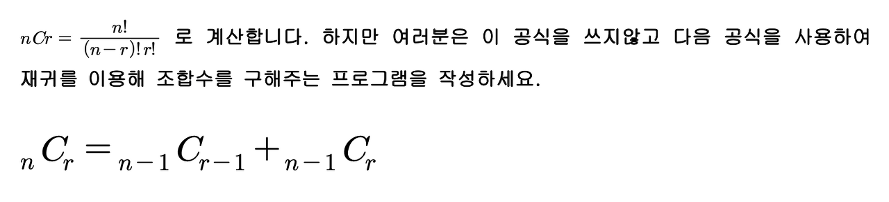

# 조합의 경우수(메모이제이션)



### ▣ 입력설명

첫째 줄에 자연수 n(3<=n<=33)과 r(0<=r<=n)이 입력됩니다.

### ▣ 출력설명

첫째 줄에 조합수를 출력합니다.

### ▣ 입력예제 1

5 3

### ▣ 출력예제 1

10

### ▣ 입력예제 2

33 19

### ▣ 출력예제 2

818809200

이문제를 처음 풀었을때 되게 빨리풀어서 뿌듯했다

```javascript
//처음 코드
function solution(n, r) {
  return DFS(n, r);

  function DFS(n, r) {
    if (n === r) return 1;
    else if (r === 1) return n;
    else return DFS(n - 1, r - 1) + DFS(n - 1, r);
  }
}
```

근데 조금 큰수가 들어가니까 속도가 심각하게 느렸다.  
사실 풀기위해 노트에 트리를 그리면서도 같은 Combination이 나오는데 이거 매번 중복 연산하면 느릴거같은데? 라고 생각했는데 그게 현실이된듯

```javascript
//          5C3
//   4C2             4C3
// 3C1  3C2        3C2  3C3
//    2C1 2C2    2C1 2C2

//내코드
function solution(n, r) {
  let arr = Array.from(Array(n + 1), () => Array(r + 1).fill(0));
  return DFS(n, r);

  function DFS(n, r) {
    if (arr[n][r] !== 0) return arr[n][r];
    else if (n === r || r == 0) return 1;
    else if (r === 1) return n;
    else {
      return (arr[n][r] = DFS(n - 1, r - 1) + DFS(n - 1, r));
    }
  }
}

//강의코드
function solution2(n, r) {
  let answer = [];
  let dy = Array.from(Array(35), () => Array(35).fill(0));

  function DFS(n, r) {
    if (dy[n][r] > 0) return dy[n][r];
    if (n === r || r === 0) return 1;
    else return (dy[n][r] = DFS(n - 1, r - 1) + DFS(n - 1, r));
  }
  answer = DFS(n, r);
  return answer;
}

console.log(solution(33, 19));
console.log(solution2(33, 19));
```

고민끝에 2차원배열\[n+1\]\[r+1\] 을 선언해서 32C18 이라면 배열\[33\]\[18\]에 저장해두고 중복연산이라면 그걸 갖다쓰자는 아이디어로 해결했다.
