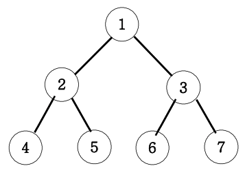

# 이진트리 순회(깊이우선탐색)

아래 그림과 같은 이진트리를 전위순회와 후위순회를 연습해보세요.



전위순회 출력 : 1 2 4 5 3 6 7

중위순회 출력 : 4 2 5 1 6 3 7

후위순회 출력 : 4 5 2 6 7 3 1

```javascript
//내코드
function solution(n) {
  let result = '';
  전위순회(n);
  // 중위순회(n);
  // 후위순회(n);

  function 전위순회(n) {
    if (n > 7) return;
    else {
      result = result + n + ' ';
      전위순회(n * 2);
      전위순회(n * 2 + 1);
    }
  }
  function 중위순회(n) {
    if (n > 7) return;
    else {
      중위순회(n * 2);
      result = result + n + ' ';
      중위순회(n * 2 + 1);
    }
  }
  function 후위순회(n) {
    if (n > 7) return;
    else {
      후위순회(n * 2);
      후위순회(n * 2 + 1);
      result = result + n + ' ';
    }
  }

  return result;
}

//강의코드
function solution2(n) {
  let answer = '';
  function DFS(v) {
    if (v > 7) return;
    else {
      answer += v + ' ';
      DFS(v * 2);
      DFS(v * 2 + 1);
    }
  }
  DFS(n);
  return answer;
}

console.log(solution(1));
```

생각보다 간단하게 풀었다.
