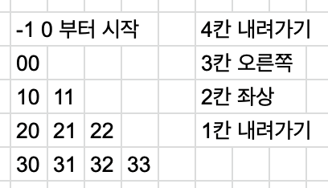

**문제 설명**

정수 n이 매개변수로 주어집니다. 다음 그림과 같이 밑변의 길이와 높이가 n인 삼각형에서 맨 위 꼭짓점부터 반시계 방향으로 달팽이 채우기를 진행한 후, 첫 행부터 마지막 행까지 모두 순서대로 합친 새로운 배열을 return 하도록 solution 함수를 완성해주세요.


제한사항

- n은 1 이상 1,000 이하입니다.

입출력 예

| n   | result                                                    |
| --- | --------------------------------------------------------- |
| 4   | \[1,2,9,3,10,8,4,5,6,7\]                                  |
| 5   | \[1,2,12,3,13,11,4,14,15,10,5,6,7,8,9\]                   |
| 6   | \[1,2,15,3,16,14,4,17,21,13,5,18,19,20,12,6,7,8,9,10,11\] |

입출력 예 설명

입출력 예 #1

- 문제 예시와 같습니다.

입출력 예 #2

- 문제 예시와 같습니다.

입출력 예 #3

- 문제 예시와 같습니다.

```javascript
function solution(n) {
  let arr = [];
  for (let i = 1; i <= n; i++) {
    arr.push(Array(i).fill(0));
  }
  const table = ['하', '우', '좌상'];
  const xy = [-1, 0];
  let number = 1;
  for (let i = 0; i < n; i++) {
    const move = table[i % 3];

    for (let j = 0; j < n - i; j++) {
      if (move == '하') {
        xy[0]++;
      }
      if (move == '우') {
        xy[1]++;
      }
      if (move == '좌상') {
        xy[0]--;
        xy[1]--;
      }
      arr[xy[0]][xy[1]] = number;
      number++;
    }
  }
  return arr.reduce((pre, curr) => [...pre, ...curr], []);
}
console.log(solution(4));
```

얼마전 `n^2 배열 자르기` 문제에서 엄청 고생해서 풀었는데 다른 사람들의 풀이를 보니 정말 간단한 규칙이있었다는것을 알고 굉장히 허탈했었다. 그래서 이번문제는 규칙을 찾기위해 꽤 오래 생각했다..만 못찾았다. 결국 처음생각한 방법대로 풀었다.



n이 4인것으로 가정하고

먼저 삼각형모양의 2차원 배열을 선언한다, 그리고 [x][y] 좌표에서

아래로 내려갈때는 x좌표를 +1 해주고

오른쪽으로 갈때는 y좌표를 +1해주고

좌상단으로 이동할때는 둘다 -1 해주는 방식이다

그리고 4,3,2,1번 반복하는 2중for문을 만들어서 돌렸다

아래는 코드 제출후 다시 코드정리해본것이다

```javascript
function solution(n) {
  let arr = Array(n)
    .fill()
    .map((_, i) => Array(i + 1).fill(0));
  let x = -1;
  let y = 0;
  let number = 0;

  const table = ['down', 'right', 'up'];

  for (let i = 0; i < n; i++) {
    for (let j = 0; j < n - i; j++) {
      if (table[i % 3] === 'down') arr[++x][y] = ++number;
      else if (table[i % 3] === 'right') arr[x][++y] = ++number;
      else if (table[i % 3] === 'up') arr[--x][--y] = ++number;
    }
  }
  return arr.reduce((pre, curr) => [...pre, ...curr], []);
}
```
